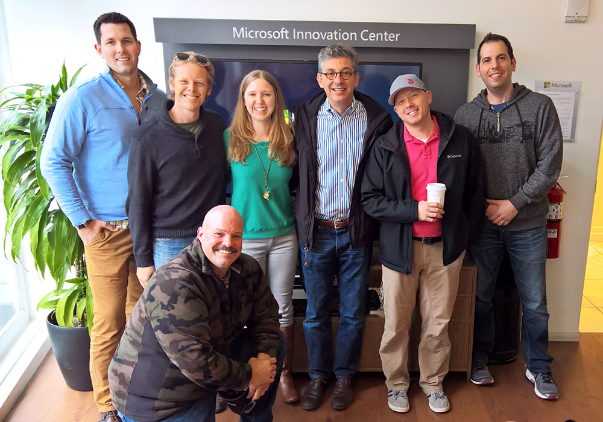
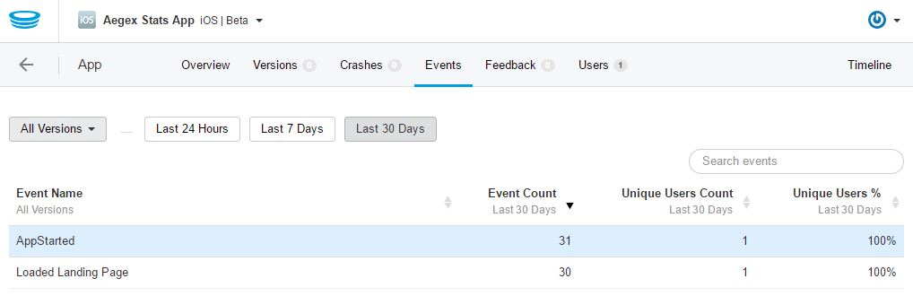
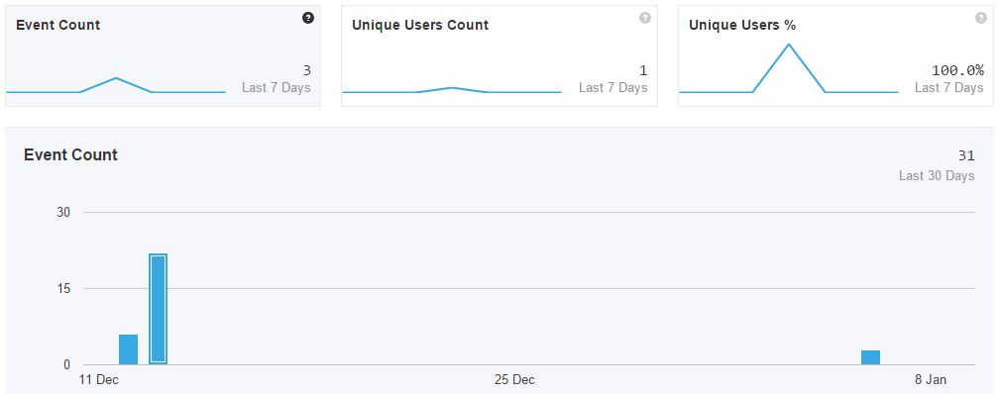
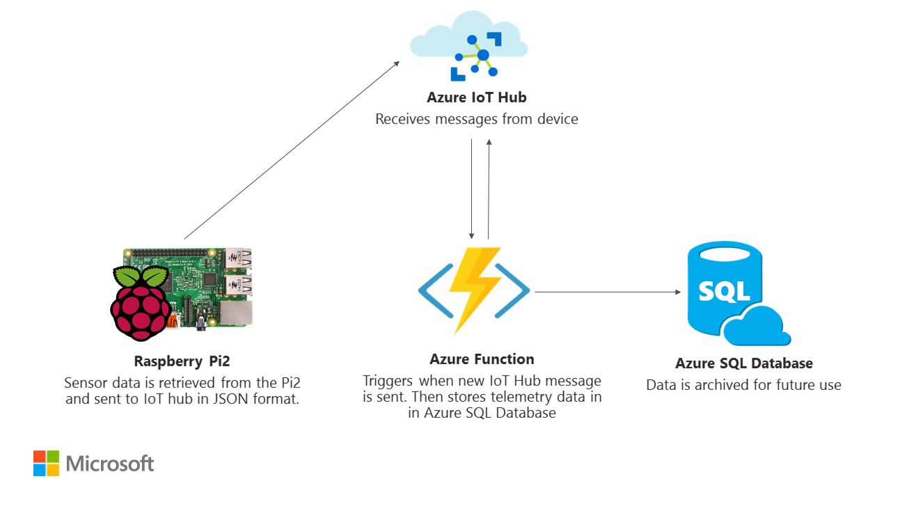

### Solution overview
TODO

### Key technologies used
- Xamarin
- IoT Hub
- Azure Functions
- HockeyApp

### Core Team:
- Kristin Ottofy [(@kristinottofy)](https://twitter.com/kristinottofy) – Technical Evangelist, Microsoft
- Joe Raio [(@joescars)](https://twitter.com/joescars) – Technical Evangelist, Microsoft
- Blain Barton [(@blainbar)](https://twitter.com/blainbar) – Technical Evangelist, Microsoft
- Dave Voyles [(@DaveVoyles)](https://twitter.com/DaveVoyles) – Technical Evangelist, Microsoft

### Aegex Team:
- Tom Ventulett - CEO, Aegex

### Development Leads:
- Ian Philpot [(@tripdubroot)](https://twitter.com/tripdubroot) – Technical Evangelist, Microsoft
- David Crook [(@Data4Bots)](https://twitter.com/Data4Bots) – Technical Evangelist, Microsoft

## Customer profile ##

### Aegex

[Aegex.com](http://www.aegex.com) | Atlanta, Georgia

Aegex provides the first Windows 10 tablet globally certified intrinsically 
safe for use in the most hazardous industrial locations worldwide.

One of their best known products is the **Aegex 10.1-inch Intrinsically Safe Tablet**

The Aegex10 IS Tablet is purpose-built for use in the most hazardous zones of 
explosive environments. Incapable of igniting a spark, this patents-pending
industrial device allows for superior mobile communications on dangerous job
sites where traditional devices cannot be used.

 
## Problem statement ##
TODO
This section will define the problem(s)/challenges that the customer wants to address with an IoT solution. Include things like costs, customer experience, etc.

Aegex is devoted to protecting workers in hazardous locations such as oil rigs or mines in which people are in proximity to hazardous materials such as flamable liquids or toxic gases. Aegex has developed a certified intrinsically safe tablet for use in those environments and needed a low-cost, scalable, and efficient platform that allows users to interact with and manage their setting. They first experimented by placing an IoT infrasture using Raspberry Pis and all sorts of sensors at the [Guardian Center](https://guardiancenters.com/) in Perry, GA where they could collect real-time gas, flame, weather, and other crucial pieces of data. Microsoft has helped expand on the application by providing a Raspberry Pi prototype that connects to Azure and displays data onto a Xamarin app.
 

TODO: *include a customer quote that highlights the customer’s problem(s)/challenges.*

## Expected results / outcome ##
Microsoft's goal was to deliver a working Xamarin application that would be on the path to production that displayed real-time data collected from sensors in a workplace. They ended up building an IoT solution with a Raspberry Pi and sensors from the Microsoft Innovation Center in Atlanta. This solution uses Windows 10 IoT Core and Azure IoT Hub to send messages to Azure. An Azure Function activates on a new message in the Hub and executes a command to store this data in a scalable SQL database. Finally, a Xamarin app using Hockey App pulls the data and displays on multiple platforms including Windows, iOS, and Android. 
 
## Solution and steps ##
The majority of your win artifacts will be included in this section, including (but not limited to) the following: Pictures, drawings, architectural diagrams, value stream mappings and demo videos.

- What was worked on and what problem it helped solve.

There were several parts to this project, all of which were worked on concurrently to bring together a four-part solution.

**Xamarin**

[Xamarin](https://www.xamarin.com/) is a C# framework for creating mobile applications across iOS, Android, and Windows 10. 
With Xamarin we created two pages: A landing page which draws the name of each IoT sensor and a details page, 
offers a more in-depth analysis of each sensor.

All of the data is retrieved from an Azure Function, which pulls the data from an Azure SQL database. 

The Azure function serves JSON, which is parsed with Netwonsoft.JSON and drawn to the screen via XAML. 

**HockeyApp**

[HockeyApp](https://hockeyapp.net/#s) is a service for app developers to support them in various aspects of their development process,
including the management and recruitment of testers, the distribution of apps and the collection
of crash reports.

For this application, we used HockeyApp to create [custom events](https://support.hockeyapp.net/kb/general-account-management-2/getting-started-with-custom-events-public-preview),
which allows us to fire off an notification to our event hub each time that custom event is triggered. This could be used for
something as simple as notiying the dashboard each time fresh data was retrieved from the Azure Function, or how long it took
to load a specific page.  

**Internet of Things**
The intitial prototype was built using Windows 10 IoT Core installed on a Raspberry Pi 2 with the following sensors connected:
- Keyes KY-036 Metal Touch Sensor
- Keyes K869051 Gas Sensor
- Keyes KY-026 Flame Sensor
- Keyes KY-031 Knock Sensor
- Adafruit BMP280 Barometric Pressure + Temperature Sensor
- Keyes KY-028 Light Sensor

The deployed software running on the device is a Universal Windows Platform app with the Windows IoT Extension SDK. This SDK allowed the device to access the GPIO pins to manage the input and output of the sensors. Timers are enabled to collect and send data only when necessary. For instance, only if there is a fire detected does a notification get sent regarding the flame sensor. The messages are sent from the device to the cloud permitting internet connection. The code is available [here](https://github.com/kottofy/ThePiFiles).

The messages from the device are sent to an Azure IoT Hub. The IoT Hub allowed for a scalable messaging environment in which bi-directional communication is enabled. Once the devices collect sensor data, they use the IoT Hub connected service in Visual Studio to send JSON messages of the information. An Azure Function watches for new messages coming into this IoT Hub. The IoT Hub also allowed for a more secure environment in which only devices that have been properly assigned an ID and tokens can access the resource. 

A Raspberry Pi 2 was chosen as the prototype device due to it's convenience and reliability with the Windows 10 IoT Core and UWP applications. The user interface displayed on the Pi shows the latest sensor data to be sent to Azure. In the future, this can be updated to show a more robust view for easier debugging. A microcontroller such as an Arduino could have been used to gather the data and send to Azure as well and may be a viable option for future devices, although the program would likely need to be in another language and depending on the device, may not enable a user interface. 

**Azure Functions**

We use an [Azure Function](https://azure.microsoft.com/en-us/services/functions/) to monitor the data being sent up to Azure IoT Hub. The custom function triggers every time a new message is received. As they arrive, they are retrieved, then inserted into an SQL Azure database. By doing this, the data is permanently stored and can be utilized in the future with tools such as [PowerBI](https://powerbi.microsoft.com/en-us/). 

By taking advantage of Azure Functions **serverless code architecture**, Aegex does not have the complexity of managing a virtual machine. This also results in significant cost savings. 

- Architecture diagram/s (**required**). 

TODO @KRISTIN / @BLAIN

**Directions for adding images:**
 
 Add links to your images using the following absolute path:

  ``
    
  Here’s an example: 

  ``

 Note that capitalization of the file name and the file extension must match exactly for the images to render properly.

*If you’d really like to make your write-up pop, include a customer quote that highlights the solution.*

## Technical delivery ##
This section will include the following details of how the solution was implemented:

- Security details

- Device used (be specific, details if PLC, microcontroller, etc.)

- Device messages sent (packet size, frequency of send/day/device, number of messages)

- SDKs used, languages, etc.

**Xamarin & HockeyApp**
- C# / XAML

**Azure Functions**
- C#

**Windows 10 IoT**
- C#
- Raspberry Pi

TODO 

- Code artifacts

- Pointers to references or documentation

- Learnings from the Microsoft team and the customer team

HockeyApp was a bit overwhelming initially, because the name spaces and API are not identical across the three platforms:
iOS, Android, and Windows. Becaue of this, it took londer than expected to implement.

Furthermore, on iOS HockeyApp continues to throw the error *The authentication token could not be stored due to a keychain error.*

[This is a known issue,](https://support.hockeyapp.net/discussions/problems/63710-the-authentication-token-could-not-be-stored-due-to-a-keychain-error) 
and the team hopes to have it resolved with future iterations of xCode. 

Despite this error, HockeyApp still works, and all of my events displayed correctly in the dashboard. 

``
 
## Conclusion ##

This section will briefly summarize the technical story with the following details included:

- Measurable impact/benefits resulting from the implementation of the solution.

- General lessons:

  - Insights the team came away with.

  - What can be applied or reused for other environments or customers.

- Opportunities going forward:

  - Details on how the customer plans to proceed or what more they hope to accomplish.

*include a customer quote highlighting impact, benefits, general lessons, and/or opportunities.*

## Additional resources ##
- Documentation

- Blog posts

- GitHub repos

[Xamarin & HockeyApp Portion of this Project on GitHub](https://github.com/DaveVoyles/Aegex-Xamarin-IoT-Display)

