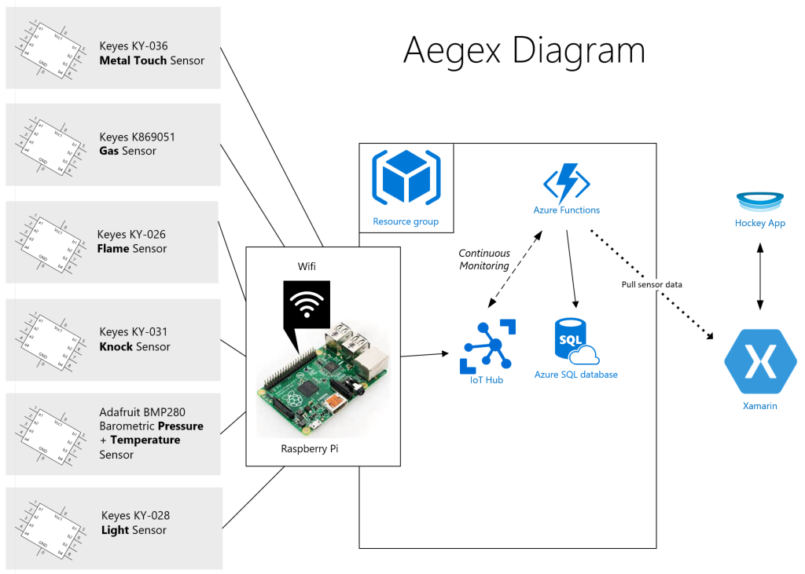

# Aegex and Microsoft IoT and Mobile App

This is a Xamarin app solution built with Aegex that displays data from IoT devices 
using a Raspberry Pi with Microsoft technologies.

### Key technologies used
- Xamarin
- Azure IoT Hub
- Azure Functions
- HockeyApp
- Azure SQL Server and Databse

### Core Team:
- Kristin Ottofy [(@kristinottofy)](https://twitter.com/kristinottofy) – Technical Evangelist, Microsoft
- Joe Raio [(@joescars)](https://twitter.com/joescars) – Technical Evangelist, Microsoft
- Blain Barton [(@blainbar)](https://twitter.com/blainbar) – Technical Evangelist, Microsoft
- Dave Voyles [(@DaveVoyles)](https://twitter.com/DaveVoyles) – Technical Evangelist, Microsoft

### Aegex Team:
- Tom Ventulett - CEO, Aegex

### Development Leads:
- Ian Philpot [(@tripdubroot)](https://twitter.com/tripdubroot) – Technical Evangelist, Microsoft
- David Crook [(@Data4Bots)](https://twitter.com/Data4Bots) – Technical Evangelist, Microsoft

### Production Development Team:
- Jared Rhodes, FuseThru
- Marshall Corry, FuseThru

## Aegex

[Aegex.com](http://www.aegex.com) | Atlanta, Georgia

Aegex provides the first Windows 10 tablet that is globally certified intrinsically safe for use in 
the most hazardous industrial locations worldwide.

One of their best known products is the [Aegex10 Intrinsically Safe Tablet](http://aegex.com/products/aegex10-intrinsically-safe-tablet/). 
Incapable of igniting a spark that could cause an explosion in combustible environments, 
this patents-pending industrial device connects users to real-time data and communications 
in oil refineries, chemical manufacturing facilities, mines, power plants and other hazardous 
locations where traditional devices are not permitted. Access to Cloud data and services 
streamlines workflow and collaboration, helping to improve efficiency and productivity.

Microsoft chose to work with Aegex for their commitment to improving the safety and lives
of workers in hazardous environments. 

## Problem statement

Aegex is devoted to protecting workers in hazardous locations such as 
oil rigs or mines in which people are in proximity to hazardous 
materials such as flamable liquids or toxic gases. Aegex has developed 
a certified intrinsically safe tablet for use in those environments 
and needed a low-cost, scalable, and efficient platform that allows 
users to interact with and manage their settings. They first 
experimented by placing an IoT infrastructure using Raspberry Pis 
and all sorts of sensors at the [Guardian Centers](https://guardiancenters.com/) in Perry, GA where 
they could collect real-time gas, flame, weather, and other crucial 
pieces of data. Microsoft has helped expand on the application by 
providing a Raspberry Pi prototype that connects to Azure and displays 
data onto a Xamarin app.

TODO: *include a customer quote that highlights the customer’s problem(s)/challenges.*

## Expected results / outcome

Microsoft's goal was to deliver a working Xamarin application that would be on 
the path to production that displayed real-time data collected from sensors in 
a workplace. They built an IoT solution with a Raspberry Pi and sensors from 
the [Microsoft Innovation Center in Atlanta](http://www.flatironcity.com/microsoftinnovationcenter). 
This solution uses Windows 10 IoT Core and Azure IoT Hub to send messages to the cloud. 
An Azure Function activates on a new message in the Hub and executes a command to store 
this data in a scalable SQL database. Finally, a Xamarin app using HockeyApp pulls the 
data and displays on multiple platforms including Windows, iOS, and Android. 

 
## Solution and steps ##

There were several parts to this project, all of which were worked on concurrently to bring 
together a four-part solution.

### Xamarin

[Xamarin](https://www.xamarin.com/) is a C# framework for creating mobile applications 
across iOS, Android, and Windows 10. 
With Xamarin we created two pages: A landing page which draws the name of each IoT sensor
and a details page, offers a more in-depth analysis of each sensor.

All of the data is retrieved from an Azure Function, which pulls the data from an Azure SQL database. 

The Azure function serves JSON, which is parsed with Netwonsoft.JSON and drawn to the screen via XAML. 

### Internet of Things

The intitial prototype was built using Windows 10 IoT Core installed on a Raspberry Pi 2 
with the following sensors connected:
- Keyes KY-036 Metal Touch Sensor
- Keyes K869051 Gas Sensor
- Keyes KY-026 Flame Sensor
- Keyes KY-031 Knock Sensor
- Adafruit BMP280 Barometric Pressure + Temperature Sensor
- Keyes KY-028 Light Sensor

### Azure Functions

We use an [Azure Function](https://azure.microsoft.com/en-us/services/functions/) to 
monitor the data being sent up to Azure IoT Hub. The custom function triggers every 
time a new message is received. As they arrive, they are retrieved, then inserted into 
an Azure SQL database. By doing this, the data is permanently stored and can be utilized 
in the future with tools such as [PowerBI](https://powerbi.microsoft.com/en-us/). 

By taking advantage of Azure Functions **serverless code architecture**, Aegex does not 
have the complexity of managing a virtual machine. This also results in significant cost savings. 

# Technical delivery

## Xamarin

The Xamarin application is written in C#/XAML. The code is available [here](https://github.com/aegexdev/Aegex-Xamarin-IoT-Display). 

Future hopes for the application is to display data more cleanly including graphs and charts, 
ideally from Power BI. 

One note, the variable `_sDomain` in the [LandingPage.xaml.cs](https://github.com/aegexdev/Aegex-Xamarin-IoT-Display/blob/master/1to1Core/_1to1Core/Views/LandingPage.xaml.cs)
file is the URL from the `GetCurrentSensorValues` Azure function. 

[HockeyApp](https://hockeyapp.net/#s) is a service for app developers to support them 
in various aspects of their development process,including the management and recruitment 
of testers, the distribution of apps and the collection
of crash reports.

For this application, we used HockeyApp to create [custom events](https://support.hockeyapp.net/kb/general-account-management-2/getting-started-with-custom-events-public-preview),
which allows us to fire off an notification to our event hub each time that custom event is triggered. This could be used for
something as simple as notiying the dashboard each time fresh data was retrieved from the Azure Function, or how long it took
to load a specific page.  

## Azure Functions

Two C# Azure Functions are used in order to process received messages in the IoT Hub from the
device and to send the data as a JSON message to store in the Azure SQL Database. The function
must have the variable `SensorReadingContext` declared in the Application Settings. 
The code is available [here](https://github.com/aegexdev/ThePiFilesAF).

The function, `GetCurrentSensorValues` utilizes the IoT Hub endpoint for it's Event Hub found in the Operations Monitoring
blade in Azure. The downfall here is that using an external monitor such as Device Explorer 
is now disabled since the Azure Function has taken over as the primary watcher. 

The function `SensorReadingtoSQL` needs the endpoint variable, `iothubconnection`, declared in 
Applicationsettings. Additioanlly, the name of the hub must be updated in the function.json 
file for the variable `path`. 

## Internet of Things

The software running on a Raspberry Pi 2 Mobel B V1.1 is a C#/XAML Universal Windows Platform 
app with the 
Windows IoT Extension SDK running Windows 10 IoT Core version 10.0.14393.576. This SDK allowed 
the device to access the GPIO pins to manage 
the input and output of the sensors. Windows 10 IoT Core was chosen to extend on their already
implemented structure and desire to continue with the Windows brand. A Raspberry Pi was chosen 
for the same reasons and because of the integration support with Microsoft technologies.

Timers are enabled to collect and send data only when 
necessary. For instance, only if there is a fire detected does a notification get sent 
regarding the flame sensor. Other data is collected and sent every two seconds. The messages 
are sent from the device to the cloud permitting 
internet connection. The code is available [here](https://github.com/aegexdev/ThePiFiles).

The messages from the device are sent to an Azure IoT Hub via HTTP. The IoT Hub allows for a 
scalable messaging environment in which bi-directional communication is enabled. Once the 
devices collect sensor data, they use the IoT Hub connected service sample in Visual Studio to 
send JSON messages of the information. An Azure Function watches for new messages coming 
into this IoT Hub. The IoT Hub also allowed for a more secure environment in which only 
devices that have been properly assigned an ID and tokens can access the resource. Futher 
securities measures may take place in a later phase.

A Raspberry Pi 2 was chosen as the prototype device due to it's convenience and reliability 
with the Windows 10 IoT Core and UWP applications. The user interface displayed on the Pi 
shows the latest sensor data to be sent to Azure. In the future, this can be updated to 
show a more robust view for easier debugging. A microcontroller such as an Arduino could 
have been used to gather the data and send to Azure as well and may be a viable option for 
future devices, although the program would likely need to be in another language and 
depending on the device, may not enable a user interface. 

A future update to this application may be to limit the number of messages the device sends 
to the IoT Hub per day or use a field gateway such as the Azure IoT Gateway SDK.
Currently, Azure receives 30 messages per minute plus any anomolies 
detected such as flame or metal touch. In production, the ideal situation may be to store
this data local on the Pi and send to Azure much more infrequently. That would decrease the
cost, especially if more devices are also sending data. This frequency can currently be changed
by updating the `SENSOR_CHECK_TIME` variable in [MainPage.xaml.cs](https://github.com/kottofy/ThePiFiles/blob/master/SensorApp/MainPage.xaml.cs).

## Costs

One of the reasons for choosing this solution is the potential of high ingestion of messages
being sent over the cloud. By eliminating Stream Analytics and a Service Bus Queue where the 
cost would be $0.05 per million operations for a Service Bus Queue plus a Stream Analytics job at 
$81.84 per month, Aegex would only spend $55.80 with a Basic app service plan at today's current
pricing.

# Future Opportunities

In May, Aegex is planning hold a conference for ~200 guests at the Guardian Centers in Atlanta. 
The goal there is to share this project and future opportunities for industry in IoT. Aegex 
hopes to have a system developed where each attendee will be able to build their own IoT device
and set out in the facility to collect real-time data.

Additionally, Aegex would like to use machine learning to detect anomolies in their data and
use predictive analytics to determine optimal evacuation routes, serious threats, and other
necessary alerts. Upon detection, the Xamarin app would ideally notify the user that there is
an issue via a Push Notification from Azure. Further notifications could extend to watches 
employees wear for faster alerts to aid in saving lives.

As for IoT, Aegex will need to have the devices certified for hazardous environments. There 
currently exists no solution for the certifications they require at a reasonable price. 
Additionally, each of the sensors would need to be tested. Aegex would likely need to design
their own hardware system to support these needs. Wifi is also not always available in the 
field. Therefore, they may need to partner with other companies to find a solution.

# Conclusion 

### Xamarin Reflection

The production development decided that it is best to create a PCL project
rather than the Shared project that was created for the POC. They will also be
adding a number of features such as a login portal for individual users to see
their devices.

### HockeyApp Reflection
HockeyApp was a bit overwhelming initially, because the name spaces and API are not 
identical across the three platforms:
iOS, Android, and Windows. Becaue of this, it took longer than expected to implement.

Furthermore, on iOS HockeyApp continues to throw the error *The authentication token 
could not be stored due to a keychain error.*

[This is a known issue,](https://support.hockeyapp.net/discussions/problems/63710-the-authentication-token-could-not-be-stored-due-to-a-keychain-error) 
and the team hopes to have it resolved with future iterations of xCode. 

Despite this error, HockeyApp still works, and all of my events displayed correctly 
in the dashboard. 

### Azure Function Reflection

The Azure Functions piece was exciting! The templates that are offered when first
creating a Function app do not explicitly include IoT Hub monitoring. This meant
that the team here had to do some creative work to achieve this possibly first
time ever created scenario!
 
### Internet of Things Reflection

The IoT Hub, Windows 10 IoT Core, and all of the SDKs and tools make communication
between cloud and device much easier. These pieces fit together so well and 
this part of the project went smoothly. 

# GitHub Repositories for this Project
- [Xamarin & HockeyApp](https://github.com/DaveVoyles/Aegex-Xamarin-IoT-Display)
- [IoT UWP](https://github.com/aegexdev/ThePiFiles)
- [Azure Function](https://github.com/aegexdev/ThePiFilesAF)

# References

- [Azure Functions Event Hub bindings](https://docs.microsoft.com/en-us/azure/azure-functions/functions-bindings-event-hubs)
- [Windows 10 IoT Core](https://developer.microsoft.com/en-us/windows/iot)
- [Intro to the Universal Windows Platform](https://msdn.microsoft.com/en-us/windows/uwp/get-started/universal-application-platform-guide)
- [Introduction to Mobile Development](https://developer.xamarin.com/guides/cross-platform/getting_started/introduction_to_mobile_development/)

TODO: Remove this
 Add links to your images using the following absolute path:
  ``
  Here’s an example: 
  ``
 Note that capitalization of the file name and the file extension must match exactly for 
 the images to render properly.

*If you’d really like to make your write-up pop, include a customer quote that highlights the solution.*

